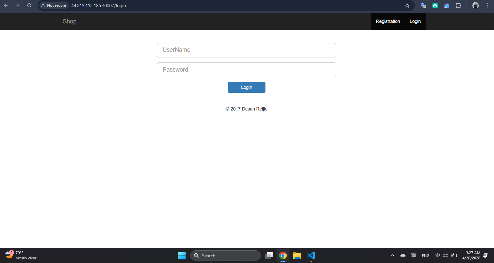
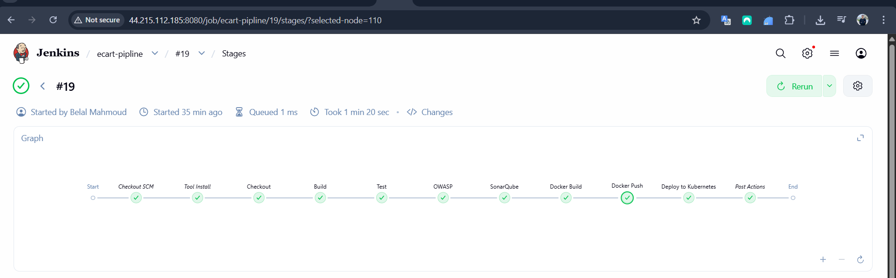
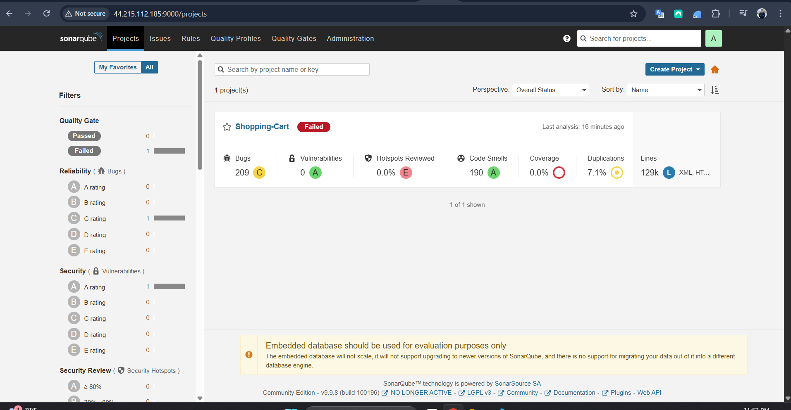
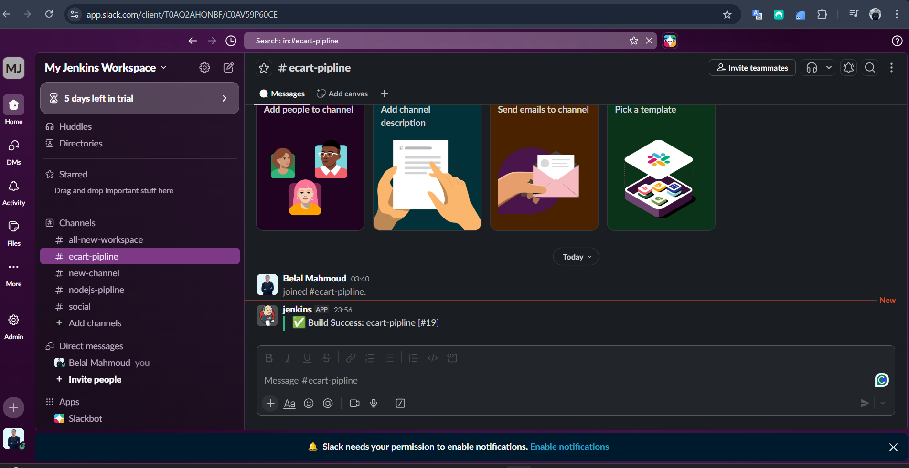
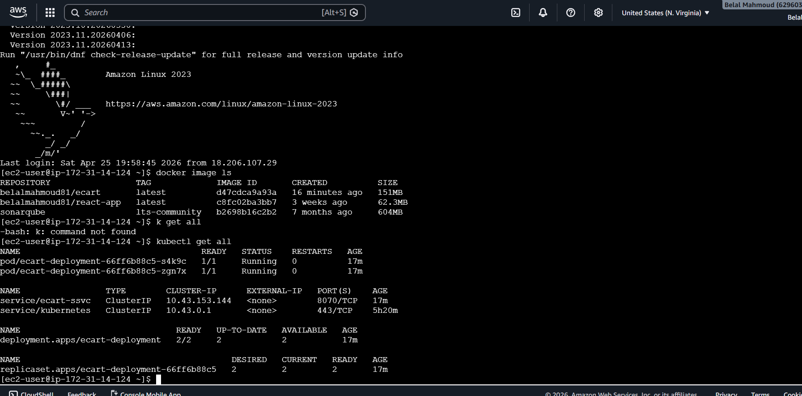

# 🛒 Cloud-Native Shopping Cart — DevOps & CI/CD Ready

<p align="center">
  
  
  
  
  
  
</p>

<p align="center">
  A cloud-native Spring Boot shopping cart platform built for modern DevOps operations, with end-to-end support for local development, Docker delivery, Jenkins CI/CD orchestration, SonarQube quality checks, and K3s Kubernetes deployment.
</p>

<p align="center">
  From commit to deployment, this repository demonstrates a complete cloud DevOps workflow for Java applications — automated builds, secure quality gates, containerized releases, and Kubernetes delivery.
</p>

<p align="center">
  Ideal for DevOps engineers and engineering teams who want a polished, production-ready Java app with infrastructure-as-code and continuous delivery best practices.
</p>

---

## 📑 Table of Contents

- [Architecture Overview](#-architecture-overview)
- [Tech Stack](#-tech-stack)
- [Application Features](#-application-features)
- [Project Structure](#-project-structure)
- [Local Development](#-local-development)
- [Docker Integration](#-docker-integration)
- [CI/CD Pipeline — Jenkins](#️-cicd-pipeline--jenkins)
- [Code Quality — SonarQube](#-code-quality--sonarqube)
- [Slack Notification Integration](#-slack-notification-integration)
- [Kubernetes Deployment — K3s](#️-kubernetes-deployment--k3s)

- [Author](#-author)

---

## 🏗️ Architecture Overview

This architecture diagram shows the core DevOps workflow for the project:

- GitHub commits trigger Jenkins via webhook
- Jenkins builds, tests, and runs SonarQube analysis
- Docker images are pushed to a registry
- K3s deploys the application via Kubernetes
- Slack sends pipeline status notifications

<p align="center">
  
</p>

## 🏃‍♂️ Application Running

<p align="center">
  
</p>

<p align="center">
  The live application UI and workflow shown here reflect the deployed shopping cart experience running inside the cloud-native stack.
</p>

---

## 🧰 Tech Stack

| Layer | Technology | Purpose |
|---|---|---|
| **Backend** | Spring Boot 2.7, Spring Security | REST API, Auth, Session management |
| **Frontend** | Thymeleaf | Server-side HTML rendering |
| **Database** | H2 (in-memory) | Embedded dev/test datastore |
| **Build** | Maven 3.3+ | Dependency management & packaging |
| **Containerization** | Docker | Image build & container runtime |
| **Container Runtime** | containerd + runc | K3s default runtime |
| **Orchestration** | Kubernetes (K3s) | Lightweight cloud-native deployment |
| **CI/CD** | Jenkins | Automated pipeline |
| **Code Quality** | SonarQube | Static analysis & quality gates |
| **Notifications** | Slack | Build status alerts |
| **Registry** | Docker Hub | Image storage & distribution |

---

## 🚀 Application Features

- User authentication (registration & login) via Spring Security
- Per-user session-based shopping cart
- Fully transactional checkout operations
- H2 embedded database with web console for development
- HAL REST browser for API exploration
- Clean Thymeleaf UI with responsive layout

---

## 📁 Project Structure

```
.
├── src/
│   └── main/
│       ├── java/           # Spring Boot source code
│       └── resources/
│           └── application.properties   # App config (port, credentials, DB)
├── Docker/
│   └── Dockerfile          # Multi-stage Docker build
├── Kubernetes/
│   └── deploymentservice.yml  # K8s Deployment + Service manifest
├── Scripts/
│   ├── mvnw                # Maven wrapper
│   └── run_docker.sh       # Docker helper script
├── Jenkinsfile             # Declarative Jenkins pipeline
└── pom.xml                 # Maven project descriptor
```

---

## 💻 Local Development

### Prerequisites

| Tool | Version |
|---|---|
| Java | 8+ |
| Maven | 3.3+ |
| Docker | Latest |
| kubectl | 1.24+ (optional) |

### Run with Maven

```bash
# Clone the repository
git clone https://github.com/Belal2015/shopping-cart.git
cd shopping-cart

# Run directly
mvn spring-boot:run

# Or build and run the JAR
mvn clean package
java -jar target/shopping-cart-0.0.1-SNAPSHOT.jar
```

### Default Credentials

| Role | Username | Password |
|---|---|---|
| Admin | `admin` | `admin` |
| User | `user` | `password` |

### Useful Endpoints

| Endpoint | URL |
|---|---|
| Application | http://localhost:8070/home |
| H2 Database Console | http://localhost:8070/h2-console |
| HAL REST Browser | http://localhost:8070/ |

> **H2 JDBC URL:** `jdbc:h2:mem:shopping_cart_db`

---

## 🐳 Docker Integration

The application ships with a production-ready `Dockerfile` under `Docker/`.

### Build & Run

```bash
# 1. Package the application
mvn clean package

# 2. Build the Docker image
docker build -t shopping-cart:dev -f Docker/Dockerfile .

# 3. Run the container
docker run --rm -it \
  -p 8070:8070 \
  --name shopping-cart \
  shopping-cart:dev
```

### Using the Helper Script

```bash
chmod +x Scripts/run_docker.sh
Scripts/run_docker.sh
```

### Tag & Push to Docker Hub

```bash
docker tag shopping-cart:dev <your-dockerhub-user>/shopping-cart:latest
docker push <your-dockerhub-user>/shopping-cart:latest
```

---

## ⚙️ CI/CD Pipeline — Jenkins

The `Jenkinsfile` at the project root defines a fully declarative pipeline.

### Pipeline Stages

<p align="center">
  
</p>

### Jenkins Setup

1. **Install plugins:** Git, Docker Pipeline, SonarQube Scanner, Slack Notification
2. **Add credentials:**
   - `dockerhub-credentials` — Docker Hub username/password
   - `sonar-token` — SonarQube authentication token
   - `slack-token` — Slack bot/webhook token
3. **Create a Pipeline job** pointing to this repository
4. **Enable:** "GitHub hook trigger for GITScm polling"

### Webhook Automation (GitHub → Jenkins)

To trigger builds automatically on every push:

1. Go to **GitHub repo → Settings → Webhooks → Add webhook**
2. Set **Payload URL** to:
   ```
   http://<jenkins-server>:8080/github-webhook/
   ```
3. Set **Content type** to `application/json`
4. Choose **Just the push event**
5. Save — Jenkins will now build on every commit

> ⚠️ Your Jenkins server must be publicly reachable from GitHub for webhooks to work. Use a reverse proxy (Nginx) or a tunnel (ngrok) if running locally.

---

## 📊 Code Quality — SonarQube

SonarQube is integrated into the pipeline to enforce quality gates before Docker builds proceed.

<p align="center">
  
</p>

### What is Analysed

- Code coverage (unit + integration tests)
- Code smells, duplications, and complexity
- Security vulnerabilities and hotspots
- Maintainability ratings

### Running Analysis Locally

```bash
mvn sonar:sonar \
  -Dsonar.projectKey=shopping-cart \
  -Dsonar.host.url=http://localhost:9000 \
  -Dsonar.login=<your-token>
```

---

## 💬 Slack Notification Integration

Jenkins sends colour-coded Slack messages to your team channel after each build.

<p align="center">
  
</p>

| Status | Colour | Message Includes |
|---|---|---|
| ✅ Success | Green | Job name, build number, duration |
| ❌ Failure | Red | Job name, failed stage, error link |

### Pipeline Snippet

```groovy
post {
  success {
    slackSend(
      channel: '#ci-cd',
      color: 'good',
      message: "✅ Build *${env.JOB_NAME} #${env.BUILD_NUMBER}* succeeded. (<${env.BUILD_URL}|Open>)"
    )
  }
  failure {
    slackSend(
      channel: '#ci-cd',
      color: 'danger',
      message: "❌ Build *${env.JOB_NAME} #${env.BUILD_NUMBER}* failed. (<${env.BUILD_URL}|Open>)"
    )
  }
}
```

---

## ☸️ Kubernetes Deployment — K3s

The app is deployed to a K3s cluster using a single manifest that defines both a `Deployment` and a `Service`.

<p align="center">
  
</p>

### Apply the Manifest

```bash
kubectl apply -f Kubernetes/deploymentservice.yml
```

### Verify the Deployment

```bash
# Check pods are running
kubectl get pods -l app=shopping-cart

# Check the service
kubectl get svc shopping-cart

# View logs
kubectl logs -l app=shopping-cart --follow

# Describe deployment
kubectl describe deployment shopping-cart
```

### Rollout & Rollback

```bash
# Trigger a rolling update (after pushing a new image)
kubectl set image deployment/shopping-cart \
  shopping-cart=<your-image>:<new-tag>

# Check rollout status
kubectl rollout status deployment/shopping-cart

# Roll back to the previous version
kubectl rollout undo deployment/shopping-cart
```

### Scale the Deployment

```bash
kubectl scale deployment shopping-cart --replicas=3
```

### K3s-Specific Notes

- K3s bundles **Traefik** as the default ingress controller — no separate install needed
- The default container runtime is **containerd** (not Docker daemon)
- Use `kubectl get nodes` to confirm node status after installation
- K3s kubeconfig is located at `/etc/rancher/k3s/k3s.yaml`

---

## 👤 Author

**Belal Mahmoud** — DevOps Engineer

[](https://github.com/Belal2015)
[](https://www.linkedin.com/in/belal-mahmoud-devops/)
[](mailto:belalmahmoud8183@gmail.com)

---

## 📝 License

This project is licensed under the **MIT License**. See the [LICENSE](LICENSE) file for details.

---

> 💡 **Tip:** All component configuration lives in `src/main/resources/application.properties` — server port, admin credentials, H2 datasource URL, and SonarQube settings are all tunable there without touching source code.